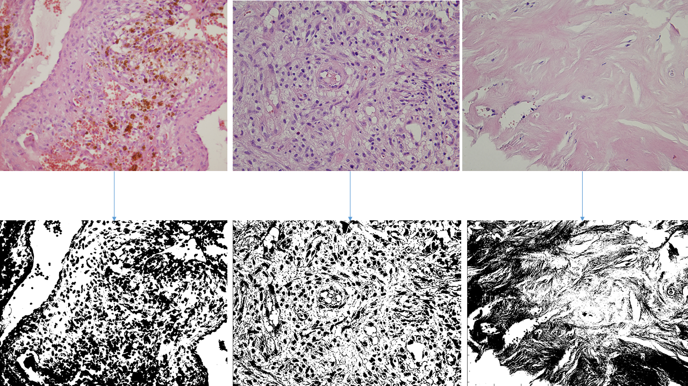

#K means clustering for binarization of images

Here i represent a pice of code written in matlab which i used for binarization of images. The main idea is to use multifractal analysis for microscopic images, made with biopsy of the patient's bone tissue, whose tumour has metastasized on the bones. Here, on the picture showed below, you may see how this algorithm takes microscopic images (upper pictures) and makes them binar (lower set of pictures). 

